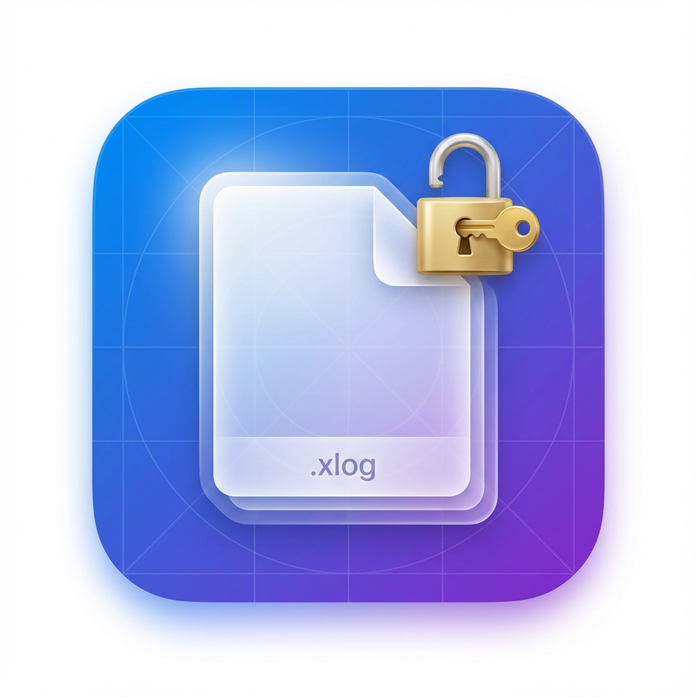

# App Icon Setup

## 快速开始

### 1. 生成所有尺寸的图标

```bash
cd /Users/yuxilong/Desktop/code/scripts/log/XLogDecoder
./generate_icons.sh
```

这将自动生成:
- `AppIcon.appiconset/` 文件夹(包含所有PNG尺寸)
- `AppIcon.icns` 文件(可选)

### 2. 集成到Xcode项目

#### 方法A: 使用AppIcon.appiconset

1. 在Xcode中创建Assets Catalog:
   ```
   File > New > File > Resource > Asset Catalog
   ```

2. 右键点击Assets.xcassets > New App Icon

3. 将`AppIcon.appiconset`文件夹中的所有PNG文件拖到对应的位置

#### 方法B: 使用.icns文件

1. 将`AppIcon.icns`拖到Xcode项目中

2. 在`Info.plist`中添加:
   ```xml
   <key>CFBundleIconFile</key>
   <string>AppIcon</string>
   ```

## 图标预览



## 设计说明

- **主色调**: 蓝紫渐变 (#007AFF → #5856D6)
- **设计元素**: 文档 + 解锁符号
- **风格**: 液态玻璃效果
- **尺寸**: 1024x1024px (原始)

详细设计文档见: [app_icon_design.md](../../../.gemini/antigravity/brain/a6acd390-73de-479c-8fd5-208ee19e76d9/app_icon_design.md)

## 文件说明

- `icon_1024x1024.png` - 原始图标(1024x1024)
- `generate_icons.sh` - 图标生成脚本
- `AppIcon.appiconset/` - 所有尺寸的PNG文件(运行脚本后生成)
- `AppIcon.icns` - macOS图标文件(运行脚本后生成)
