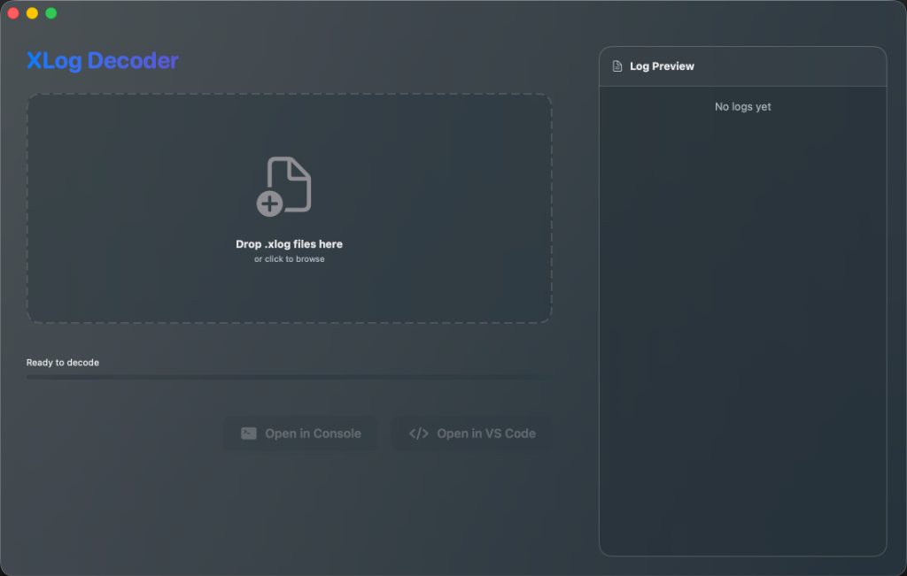
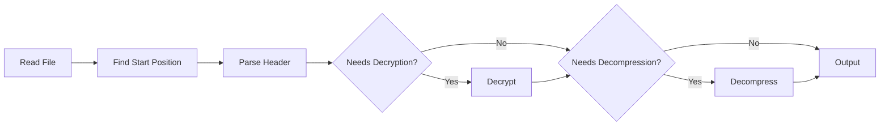

# XLog Decoder

A modern macOS application for decrypting xlog files with a beautiful glassmorphism UI.



## Features

✨ **Modern UI** - Liquid glass effect design following macOS Sequoia 26.0 aesthetics
🎯 **Drag & Drop** - Simply drag .xlog files to decode
⚡ **Real-time Progress** - Live progress bar with speed and time remaining
📄 **Live Preview** - Real-time log preview as decoding progresses
🔓 **Multiple Encryption Support** - XOR, TEA decryption algorithms
📦 **Compression Support** - zlib decompression
🚀 **Quick Open** - Open decoded logs in Console.app or VS Code

## Supported Log Types

| Magic Number | Encryption | Compression | Status |
|--------------|------------|-------------|--------|
| 0x03 | XOR | No | ✅ Supported |
| 0x04 | XOR | Yes | ✅ Supported |
| 0x05 | XOR | Yes (Segmented) | ✅ Supported |
| 0x06 | XOR | No | ✅ Supported |
| 0x07 | TEA (ECDH) | Yes | ⚠️ Partial |
| 0x08 | None | No | ✅ Supported |
| 0x09 | None | Yes | ✅ Supported |

## Requirements

- macOS 14.0 or later
- Xcode 15.0 or later (for building)

## Building from Source

1. Clone the repository
2. Open the project in Xcode
3. Build and run (⌘R)

## Usage

1. Launch XLog Decoder
2. Drag and drop an .xlog file onto the drop zone (or click to browse)
3. Wait for decoding to complete
4. Click "Open in Console" or "Open in VS Code" to view the decoded log

## Project Structure

```
XLogDecoder/
├── Models/              # Data models
│   ├── MagicNumber.swift
│   ├── LogHeader.swift
│   ├── DecoderState.swift
│   └── DecoderError.swift
├── ViewModels/          # Business logic
│   └── XLogDecoder.swift
├── Views/               # UI components
│   ├── Components/
│   └── Modifiers/
├── Services/            # Core services
│   ├── Parser/
│   ├── Decryption/
│   └── Compression/
└── Utilities/           # Helper functions
```

## Architecture

The app follows MVVM architecture:

- **Models**: Define data structures for log headers, magic numbers, and states
- **ViewModels**: Handle decoding logic, state management, and file operations
- **Views**: SwiftUI components with glassmorphism effects
- **Services**: Modular services for parsing, decryption, and decompression

## Decoding Process



## Known Limitations

- ECDH key exchange (0x07) is not fully implemented
- Large files (>100MB) may take longer to process
- Syntax highlighting in preview is not yet implemented

## Roadmap

- [ ] ECDH密钥交换支持 (0x07)
- [ ] 语法高亮
- [ ] 批量处理
- [ ] 性能优化
- [ ] 单元测试

## License

MIT License

## Credits

Based on the xlog format from [Tencent Mars](https://github.com/Tencent/mars)
